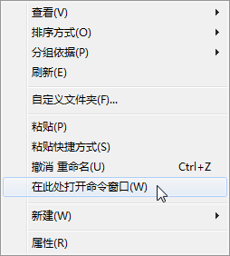
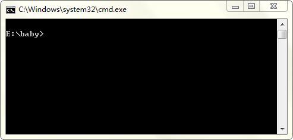
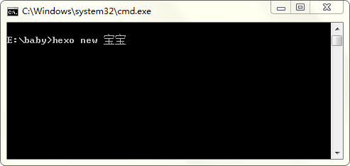
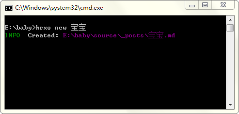
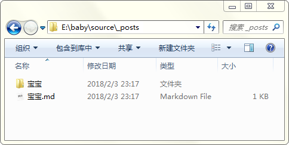
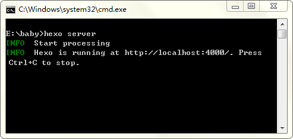
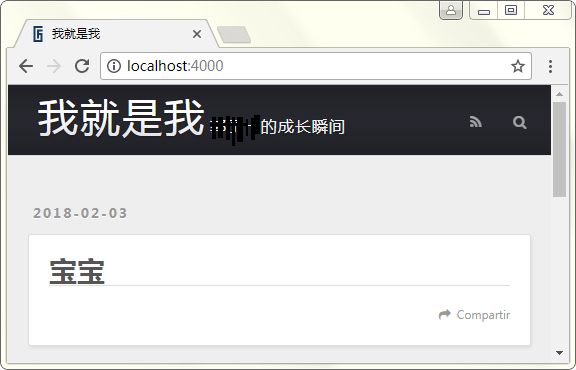
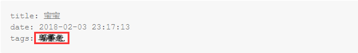
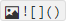
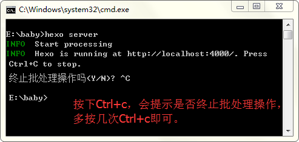

#### 操作手册

以新建一个名为“宝宝”的文章为例，说明如何新建、编辑、查看效果。请严格按照以下步骤操作：

1. 打开E盘下的baby文件夹，按住shift键，在文件夹空白处点击鼠标右键，选择“在此处打开命令窗口”，

   

   打开了命令窗口，如下所示。

   

   输入以下命令

   ```
   hexo new 宝宝
   ```

   **注意：中间的空格**

   

   点击Enter键，会提示新建了一个md文件。

   

   可以看到，在baby\source\\_posts文件夹下新建了一个名为“宝宝”的markdown文件（.md）和一个名为“宝宝”的文件夹。

   

   至此，文章已经新建完毕。

   在命令行工具中输入以下命令

   ```
   hexo server
   ```

   点击Enter键

   

   构建完成，在浏览器地址栏中输入并打开

   ```
   http://localhost:4000
   ```

   可以看到，刚刚新建的文章《宝宝》出现在首页。

   

   不过，此时文章是空的，所以接下来需要编辑以上新建的md文件，以填充内容。

2. 打开宝宝.md文件，有一些初始信息，在tags处填写“xxx”，注意前面有空格。

   

   在初始信息之下，就需要自己编辑内容了。为了生成的页面美观，第一行写

   ```
   &nbsp;
   ```

   回车后，正式编写文章内容。

   内容除了文字部分外，主要分为三类，图片、音频、视频。

   - [ ] 图片的操作：

         > 现在宝宝文件夹中，放置相应的图片文件
         >
         > 然后在md中，按下快捷键Ctrl+Shift+i，会生成以下结构
         >
         > 
         >
         > 在小括号里写上
         >
         > ```
         > 宝宝/20171115102908.png
         > ```
         >
         > **注意：宝宝是文件夹名称，后面的20171115102908.png是放置于宝宝文件夹中的图片名称**

   - [ ] 音频的操作

         > 和图片类似，也要先将相应的音频文件放在宝宝文件夹中
         >
         > 然后在md文件中写下
         >
         > ```
         > <audio src='./xxxx.xxx' controls='controls' >您的浏览器不支持 audio 标签。</audio>
         > ```
         >
         > **注意：修改的是src属性，改成音频对应的内容即可。**

   - [ ] 视频的操作

         > 和音频类似，区别在于写的内容为
         >
         > ```
         > <video src='./xxxxxxx.xxx'  type='video/mp4'  controls='controls'  width='270' height='510'></video>
         > ```
         >
         > **注意：修改的是src属性，改成音频对应的内容即可。**

3. 正常情况下，当编辑md文件并保存之后，刷新浏览器页面，应该能直接看到效果，如果没有，那么在命令窗口中，按下Ctrl+c（多按几次），

   

   再输入

   ```
   hexo generate
   ```

   回车之后，等构建完毕，再输入

   ```
   hexo server
   ```

   再回到浏览器中，看是否生效了，不行，则步骤3多试几次。

&nbsp;

以上即为操作说明。